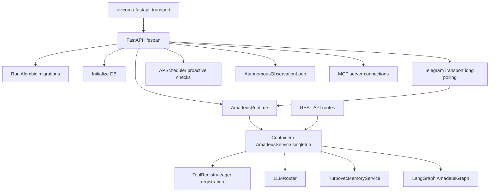
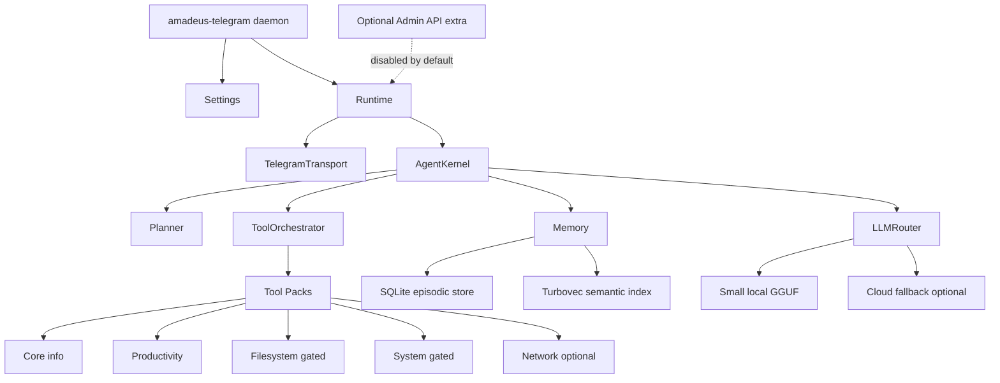

# Amadeus AI Codebase Audit and Implementation Roadmap

Audit date: 2026-06-11  
Scope: full repository review of source, tests, docs, configuration, dependencies, local runtime artifacts, and startup paths.

## Executive Summary

Amadeus has a strong foundation: a transport-agnostic runtime, explicit tool registry, policy-aware tool executor, local-first LLM routing, Turbovec memory, Telegram integration, and growing LangGraph support. The current implementation is still carrying too many surfaces for a small local-first autonomous agent: FastAPI is the real process host, Telegram is attached through FastAPI lifespan, CLI/webhook/API/auth/messaging/email/MCP/dashboard paths add maintenance and security surface, and several "autonomous" components are wrappers or prototypes rather than mature planning systems.

The highest-impact modernization is to make Telegram long polling the primary daemon entry point and demote FastAPI to an optional development/admin extra. That one move removes API auth, webhooks, CORS, Prometheus exposure, slowapi, FastAPI Users, public routes, and a large class of network-facing risks from the default runtime.

Resource usage is currently dominated by local artifacts and eager dependencies:

- Repository size observed locally: ~11 GB.
- `.venv`: ~5.1 GB.
- `Model`: ~4.5 GB, including a ~3.46 GB GGUF and duplicated embedding models.
- Runtime imports include FastAPI, auth, observability, Redis, DB, Telegram, email, Docker, sentence-transformers, LangGraph, and MCP in the default install.
- LlamaCpp is warmed eagerly at startup, which improves first response latency but hurts startup RAM/CPU on low-end machines.

Recommended target: a Telegram-first local daemon with a small bootstrap, lazy tool packs, optional extras, SQLite-by-default local persistence, explicit permission grants, and a planner that persists task graphs only for genuinely autonomous work.

## Current Architecture Analysis

Current startup path:



Important observations:

- `src/runtime/core.py` is the cleanest central boundary. It owns runtime lifecycle and exposes `process_task`.
- `src/transports/telegram_transport.py` is the desired user interface, but it is currently started by `src/transports/fastapi_transport.py`.
- `src/runtime/cognitive/core.py` creates explicit plans, steps, observations, and reflections, but it currently wraps a single `amadeus_service.handle_command` facade step. It is not yet a real planner.
- `src/app/services/agent_loop.py` has the real multi-step LangGraph loop and Mixture-of-Experts routing, but it is only invoked for narrow multi-step or expert cases.
- `src/container.py` eagerly builds a broad tool registry and imports many optional subsystems.
- `src/app/services/amadeus_service.py` mixes runtime orchestration, queue startup, memory startup, semantic router initialization, Gemini direct client handling, and LangGraph checkpointer construction.
- API auth/users/routes are complete enough to maintain, but not essential for a Telegram-only local daemon.

## Proposed Telegram-First Architecture



Target rules:

- Telegram long polling is the default and only production client.
- FastAPI is optional and disabled unless `AMADEUS_ENABLE_API=true`.
- Webhooks are removed unless explicitly reintroduced for hosted Telegram deployments.
- Tool packs are lazy and feature-gated.
- Database migrations are not run on every startup by default.
- Background loops are opt-in and rate-limited.
- The agent kernel exposes one stable interface: `handle_user_message(context, text)`.

## Technical Debt Report and Legacy Code Audit

| Finding | Evidence | Why remove or change | Maintenance cost | Performance impact | Safe removal steps |
|---|---|---|---:|---:|---|
| FastAPI as default host | `pyproject.toml` script points to `src.transports.fastapi_transport:app`; Telegram starts in FastAPI lifespan | Telegram is the only intended client; API host adds CORS, auth, metrics, routes, migrations, startup work, and network attack surface | High | High startup/import cost; extra RAM from FastAPI/auth/OTel/Prometheus | Add `src/transports/telegram_daemon.py`; switch script to daemon; move FastAPI to `[api]` extra; keep health/debug API optional |
| CLI transport | `src/transports/cli_transport.py`; README documents CLI | Not part of Telegram-first product; duplicates interaction path and test assumptions | Low | Low | Mark dev-only, remove from docs, delete after tests migrate to runtime/service fixtures |
| Webhooks and stale WhatsApp docs/tests | `src/api/routes/webhooks.py`, skipped WhatsApp tests, wiki/README references WhatsApp | Webhooks conflict with long-polling Telegram-first operation; WhatsApp appears removed but docs remain | Medium | Low to medium | Delete WhatsApp docs/tests/routes; keep Telegram webhook only if hosted mode is required behind feature flag |
| Dashboard optional extras | `streamlit*` extras in `pyproject.toml`; no dashboard app found | No active dashboard surface; dependency drift and confusion | Low | Medium install footprint if installed | Remove `dashboard` extra and docs; reintroduce later as separate package if needed |
| Email stack enabled by default | `imap-tools`, `aiosmtplib`, `email_tools`, `EmailAdapter`, messaging routes | Email is a separate client/capability, not core Telegram UI; expands secrets and leakage risk | Medium | Medium imports and tool menu noise | Move email to `[email]` extra and disabled tool pack; remove from default registry |
| MCP enabled in default dependencies | `mcp` dependency, `config/mcp_servers.yaml`, FastAPI lifespan connects enabled servers | Powerful but high-risk external tool execution channel; not needed for core local agent | High | Medium startup latency and subprocess cost | Move to `[mcp]` extra; require explicit `ENABLE_MCP=true`; add allowlist and approval UX |
| Docker sandbox default dependency | `docker>=7.0.0`, `DockerSandboxExecutor` pulls image in constructor | Docker is optional and heavy; local-first should run without daemon dependency | Medium | High install/startup cost when used | Move Docker to `[sandbox-docker]` extra; instantiate only when code tool is invoked |
| Insecure local sandbox | `src/infra/sandbox/local_executor.py` uses `exec`; comments admit it is not secure | User-supplied code can escape weak Python-level restrictions | Critical | Low performance cost, high risk | Disable by default; require Docker or no code execution; replace with RestrictedPython/nsjail/firejail only after threat model |
| Eager broad tool registration | `src/container.py` registers productivity, info, system, monitor, network, filesystem, developer, web, email, agent tools | Tools increase prompt size, import cost, attack surface, and routing ambiguity | High | Medium to high | Introduce `ToolPack` registry with lazy loading and settings-driven enablement |
| Plugin hot-loading from local directory | `ToolRegistry.discover_plugins` imports/reloads arbitrary `.py` from `plugins` | Arbitrary code execution at startup; not safe by default | High | Low to medium | Disable default discovery; require signed/approved plugins; load only after Telegram approval |
| Duplicate memory terminology | Qdrant references in config/comments, Turbovec implementation in `src/infra/turbovec_memory.py`, old `data/chroma_db` directory | Confusing architecture; stale storage can accumulate | Medium | Storage cost | Rename settings to `SEMANTIC_MEMORY_*`; document migration; archive/delete old unused local stores after backup |
| Duplicate embedding models | `Model/embed/BAAI_bge-small-en-v1.5` and `Model/embed/sentence-transformers_all-MiniLM-L6-v2` | Two embedding model caches for one active memory/router path | Low | ~200+ MB disk; possible load ambiguity | Choose one model; delete unused cache after verifying settings and router cache |
| Classifier artifacts after semantic router migration | `Model/svm_classifier.joblib`, `router_classifier.joblib`, vectorizers; docs say SVM replaced | Obsolete training artifacts and scripts add confusion | Medium | ~1 MB disk, but high conceptual debt | Remove SVM scripts/artifacts if `UnifiedSemanticRouter` is authoritative |
| `category_classifier.py` and retraining scripts | `scripts/retrain_classifier.py`, `scripts/generate_training_data.py`, classifier service | Semantic router appears to supersede ML classifier | Medium | Low runtime unless imported | Keep only as archived research or delete after confirming no imports in production |
| Office/system_control/workspace tool modules unused | unused-module scan found `office_tools.py`, `system_control_tools.py`, `workspace_tools.py` not imported | Dead or unregistered features | Medium | Low runtime, moderate maintenance | Remove or convert to disabled optional packs with tests |
| Queue worker unused | `src/infra/queue/worker.py` unused by code scan | Background queue exists but worker path is not wired into daemon | Medium | Low | Remove or wire explicitly; do not keep half-integrated queue infrastructure |
| `infra/messaging/protocols.py` unused | Protocol abstraction for multi-channel webhooks | Multi-channel architecture conflicts with Telegram-only scope | Low | Low | Delete with webhook cleanup |
| API route tests lock in old architecture | `tests/integration/api/*`, `tests/conftest.py` imports FastAPI app | Tests preserve API-first assumptions | Medium | Test startup cost | Replace with Telegram/runtime integration tests; move API tests to optional extra |
| Automatic migrations on app startup | FastAPI lifespan runs Alembic every boot | Local daemon startup should be fast and predictable; migrations are deployment operations | Medium | Startup latency and failure risk | Run migrations via install/update command; use lightweight schema init for SQLite local mode |
| Eager LlamaCpp warmup | `AmadeusRuntime.start` calls `self.llm.warmup()` | Reduces first response latency but increases startup RAM/CPU and can hurt low-end hardware | Medium | High startup RAM/CPU | Make warmup opt-in: `SLM_WARMUP_ON_START=false` by default |
| LangGraph checkpoint file in project root | `langgraph_checkpoints.sqlite` path at `BASE_DIR` | Runtime data should live under `data/` | Low | Low | Move to `DATA_DIR/checkpoints/langgraph.sqlite`; migrate existing file if present |

## Architecture Simplification Plan

Merge:

- Merge `CognitiveCore` and `AmadeusGraph` into one `AgentKernel` facade. The current cognitive core should become an event/persistence layer around the real planner, not a second planning abstraction.
- Merge `MessagingService` Telegram outbound logic into `TelegramTransport` for default mode. Keep a generic messaging service only if multi-channel support returns.
- Merge API confirmation and Telegram confirmation into a common `ApprovalService` with channel-specific presenters.

Rewrite:

- Rewrite bootstrap into a small `telegram_daemon.py` that initializes settings, DB, runtime, Telegram transport, and shutdown only.
- Rewrite tool registration as lazy `ToolPack` modules: `core`, `productivity`, `filesystem`, `system`, `developer`, `network`, `email`, `mcp`.
- Rewrite sandbox execution around one secure backend. Do not maintain a weak local `exec` fallback for untrusted code.

Remove:

- Remove CLI as a production interface.
- Remove default FastAPI/API/auth/webhook stack.
- Remove dashboard extra.
- Remove WhatsApp references and skipped tests.
- Remove obsolete SVM classifier path if semantic router is final.
- Remove unused multi-channel messaging protocols.

Migration strategy:

1. Add Telegram daemon entry point without deleting FastAPI.
2. Switch README and package script to Telegram daemon.
3. Introduce feature flags for API, email, MCP, Docker sandbox, system tools.
4. Convert tests to target runtime/Telegram transport directly.
5. Move optional dependencies into extras.
6. Delete stale routes/docs/tests after parity is proven.

## Telegram-Only Migration Plan

Target default command:

```bash
uv run amadeus
```

Expected behavior:

- Starts Telegram long polling.
- Refuses startup if `TELEGRAM_BOT_TOKEN` or `MASTER_TELEGRAM_CHAT_ID` is missing.
- Uses local SQLite/Turbovec by default.
- Loads only core, productivity, and safe information tools by default.
- Requires Telegram inline approval for high-risk tools.

Implementation steps:

1. Create `src/transports/telegram_daemon.py`.
2. Move runtime lifecycle out of FastAPI lifespan into reusable `RuntimeHost`.
3. Change `[project.scripts] amadeus` to `src.transports.telegram_daemon:main`.
4. Add optional `amadeus-api` script for FastAPI if retained.
5. Delete CLI docs and mark `cli_transport.py` dev-only or remove.
6. Remove `/api/v1/messaging` as a default outbound pathway.
7. Keep Telegram `parse_update` only for tests if webhooks are removed.

## Autonomous Agent Roadmap

Current maturity assessment:

| Capability | Current maturity | Notes |
|---|---:|---|
| Single-turn chat/tool routing | 6/10 | Functional but routing mixes heuristics, semantic router, and fallback Gemini path |
| Multi-step planning | 4/10 | LangGraph exists, but planner is shallow and invoked narrowly |
| Cognitive lifecycle persistence | 3/10 | `CognitiveCore` persists a facade step, not real subtask graphs |
| Tool orchestration | 6/10 | Registry/executor/policy exist; tool packs and least privilege need work |
| Reflection/self-correction | 3/10 | Reflect node decides next action, but no robust verifier or recovery policy |
| Long-term memory | 5/10 | Turbovec is present; needs summarization, privacy boundaries, pruning, and evaluation |
| Knowledge retrieval | 4/10 | Workspace/web/memory retrieval exist, but context budgeting is immature |
| Autonomous background operation | 2/10 | Observation loop is generic, fixed-session, and could notify unnecessarily |
| Multi-agent | 3/10 | MoE profiles exist; not yet independently scheduled agents |

Missing capabilities:

- Explicit task model: goal, constraints, deadline, permissions, success criteria.
- Planner with typed steps and dependencies.
- Verifier per tool/task type.
- Recovery policy: retry, replan, ask user, rollback, or abort.
- Budget manager for time, tokens, CPU, memory, and tool risk.
- Durable task queue with pause/resume/cancel from Telegram.
- Memory policy: what to store, summarize, forget, redact, and retrieve.
- Prompt-injection aware retrieval and tool-call firewall.
- Evaluation harness for autonomous tasks.

Priority order:

1. Stable Telegram daemon and approval UX.
2. Tool pack gating and permission model.
3. Real planner replacing facade cognitive step.
4. Typed task persistence with resume/cancel.
5. Verification and reflection policies.
6. Memory summarization and retrieval budgets.
7. Autonomous background scheduler with user-visible controls.
8. Multi-agent specialization only after single-agent loop is reliable.

## Resource Optimization Report

Recommended changes and expected reductions:

| Area | Current issue | Recommendation | Expected reduction |
|---|---|---|---|
| Install footprint | Default dependencies include API/auth/email/Docker/MCP/observability | Move to extras and keep Telegram/core default minimal | 25-45% `.venv` size reduction |
| Model disk | `Model` is ~4.5 GB with duplicate embeddings and a 3.46 GB GGUF | Keep one GGUF and one embedding model; document model cache cleanup | 200 MB to 1+ GB disk reduction, more if using smaller GGUF |
| Startup RAM | Eager LlamaCpp warmup | Lazy-load by default; warm up after first Telegram message or idle window | 1-4 GB lower startup peak depending model |
| Startup CPU | Semantic router index and memory model initialize on startup | Persist router cache; lazy-load embedding model only when memory/search needed | 20-60% startup CPU reduction |
| Tool prompt size | All tool descriptions available to LLM | Expert-scoped and intent-scoped tool menus | 30-70% prompt/context reduction for tool calls |
| DB startup | Alembic runs every FastAPI boot | Run migrations explicitly; SQLite schema bootstrap in local mode | 0.5-3s startup reduction |
| Background loops | Watchdog, proactive checks, observation loop start by default | Make loops opt-in and adaptive | 1-5% idle CPU reduction |
| Redis/Postgres | Default config assumes external services | SQLite + in-memory defaults for local daemon | Lower operational memory and startup failures |
| Docker sandbox | Docker client/image pull on construction | Instantiate only on code execution | Avoid Docker daemon startup/path checks in normal use |
| Logs | Rotating logs can include user text/tool args | Redact and reduce default log level | Lower disk churn and leakage |

Low-end consumer hardware benchmark targets:

| KPI | Target |
|---|---:|
| Cold startup without local model warmup | < 5 seconds |
| Cold startup with 1-3B GGUF warmup | < 20 seconds |
| Idle RSS without loaded GGUF | < 350 MB |
| Idle RSS with embeddings loaded | < 700 MB |
| Idle CPU | < 2% average |
| Simple Telegram response, no LLM | < 1 second |
| Local 1-3B LLM first-token latency | < 5 seconds after model load |
| Tool execution overhead excluding tool work | < 200 ms |
| Disk excluding `.venv` and models | < 100 MB |
| Default model cache | < 2.5 GB |

Model optimization strategy:

- Prefer 1B-3B instruct GGUF Q4_K_M/Q5_K_M for local default.
- Keep `SLM_CTX_SIZE=2048` on low-end machines; use 4096 only when needed.
- Keep KV-cache quantization enabled.
- Add a "router model" or deterministic parser for tool argument extraction to avoid large-model calls.
- Use one local embedding model, preferably MiniLM for low RAM or BGE-small if quality is worth the extra disk.
- Add memory retrieval caps by task class: 0 memories for simple tool calls, 3 for normal chat, 5 for planning.

## Security Audit Report

| Risk | Level | Exploit scenario | Mitigation |
|---|---|---|---|
| Weak local code sandbox | Critical | A malicious prompt asks to run Python that escapes limited builtins or abuses interpreter/process behavior | Disable `LocalSandboxExecutor`; require Docker/firejail/nsjail; deny code execution unless explicitly enabled |
| Plugin auto-import | Critical | Attacker drops or modifies a `.py` file in `plugins`; code executes at startup | Disable plugin discovery by default; require signed manifest and Telegram approval |
| Telegram SYSTEM_FULL default | High | Any allowed chat can invoke system/file tools with full permissions | Add per-tool permission grants; default to `READ_ONLY`; upgrade per request through inline approval |
| Telegram Markdown injection | Medium | Tool output with crafted Markdown breaks messages or hides text | Escape MarkdownV2 or send raw text by default |
| Tool argument leakage in confirmation | Medium | Confirmation message exposes secrets/file paths from args | Redact secrets and long values before Telegram display/logging |
| FastAPI exposed when not needed | High | Local API bound beyond loopback or reverse-proxied exposes routes/auth surface | Disable API by default; bind to loopback; require explicit opt-in |
| JWT/auth complexity | Medium | Misconfigured `SECRET_KEY` or debug routes expose data | Remove from default Telegram build; keep only optional API extra |
| Secrets in `.env` and logs | High | `.env` contains API keys and tokens; logs may capture requests | Ensure `.env` ignored; add secret scanner; redact config and logs |
| Email tools | High | Prompt injection sends or reads sensitive email | Move to opt-in tool pack; require per-send approval and recipient allowlist |
| MCP servers | High | Configured MCP command launches untrusted external process | Disable by default; command allowlist; sandbox MCP; explicit approval |
| Filesystem tools | High | Prompt asks to read/copy/delete sensitive local files | Enforce allowlisted roots, deny hidden/secret files, require approval for writes/deletes |
| System process tools | High | Prompt terminates critical apps/processes | Expand protected process list; require confirmation; add dry-run preview |
| Prompt injection through web/email/file retrieval | High | Retrieved content says "ignore previous instructions and run tool" | Treat retrieved content as untrusted data; separate tool policy from model output; add injection classifier |
| Logging vulnerabilities | Medium | User prompts, tool outputs, emails, or file contents land in rotating logs | Structured redaction and max field lengths; secure file permissions |
| Database/runtime files in repo root | Medium | Checkpoints or memories leak through git/archive | Store all runtime data under `DATA_DIR`; update `.gitignore` |

Telegram-specific controls:

- Require `MASTER_TELEGRAM_CHAT_ID`.
- Support multiple allowed IDs only through explicit list.
- Deny group chats unless enabled.
- Add `/status`, `/cancel`, `/permissions`, `/forget`, `/pause_autonomy`.
- Use inline approval for high-risk tools with redacted previews.
- Rate-limit per chat and per tool class.

## Testing Strategy

Frameworks:

- `pytest`, `pytest-asyncio`, `pytest-cov`.
- `respx` or `pytest-httpx` for HTTP clients.
- `freezegun` or time abstraction for scheduler tests.
- `hypothesis` for argument extraction and prompt-injection fuzzing.
- `bandit`, `pip-audit`, `ruff`, `mypy`.

Coverage targets:

- 85% line coverage for core runtime, services, tools, policy, memory, and Telegram transport.
- 95% coverage for security policy and permission gates.
- 70% coverage acceptable for optional adapters and provider integrations with mocked clients.

Unit tests:

- `Settings` validation and local-first defaults.
- `ToolPolicyEngine` permission/risk matrix.
- `ToolRegistry` lazy pack registration.
- `ArgumentExtractor` deterministic parsing and failure modes.
- `LLMRouter` provider order, local-only mode, limits, circuit breaker.
- `TurbovecMemoryService` store/retrieve/prune with tiny mocked embeddings.
- `AgentKernel` plan/execute/reflect state transitions.
- Telegram message parsing, authorization, approval callback, raw-text fallback.

Integration tests:

- Telegram incoming message -> runtime -> response with mocked bot.
- Telegram approval -> high-risk tool allowed/denied.
- Tool execution with filesystem sandbox roots.
- Memory store/retrieve across process restart.
- Agent multi-step task with two mocked tools.
- Optional API tests only under `api` extra.

End-to-end tests:

- Create task/reminder through Telegram and retrieve it.
- Ask a multi-step question requiring planning and tool use.
- Simulate failed tool, verify replan or clear failure message.
- Long-running task cancel via `/cancel`.
- Restart daemon and resume queued task.

Security tests:

- Prompt injection in webpage/email/file content cannot call tools.
- Unauthorized Telegram chat receives rejection.
- READ_ONLY context blocks file/system/email mutation.
- Dangerous shell/code patterns are denied.
- Secrets are redacted in logs and confirmations.
- Plugin loading denied unless explicitly approved.

CI/CD:

- PR jobs: `ruff`, `mypy`, unit tests, security tests.
- Nightly jobs: integration/E2E with optional services.
- Dependency audit weekly.
- Benchmark job stores startup/RSS/latency trend artifacts.

## Performance Benchmarking Plan

KPIs:

- Startup time: process start to Telegram polling ready.
- First user response latency.
- Warm response latency.
- RSS and peak RSS.
- VRAM usage if GPU offload is enabled.
- CPU average and p95 during idle, tool calls, local inference.
- Tool execution latency by tool category.
- Agent task completion rate.
- Error rate by subsystem.
- Confirmation timeout/denial rate.
- Memory retrieval latency and hit quality.

Benchmark harness:

- Add `scripts/benchmark_daemon.py`.
- Use `psutil` for RSS/CPU.
- Mock Telegram bot transport for repeatability.
- Run scenarios: cold boot, simple command, LLM chat, direct tool, multi-step agent, memory retrieval, high-risk approval.
- Store JSON output under `data/benchmarks/`.

Reliability targets:

- 99% simple command success on local daemon.
- 95% multi-step task completion for curated benchmark tasks.
- 0 unauthorized tool executions in security suite.
- < 1 unrecovered background task exception per 24h soak test.

## Resource Reduction Plan

Phase 1 reductions:

- Disable FastAPI default host.
- Disable eager model warmup.
- Move email/MCP/Docker/dashboard/API dependencies to extras.
- Remove duplicate embedding cache and obsolete classifier artifacts.
- Make background loops opt-in.

Expected phase 1 result:

- Startup time reduced by 30-60%.
- Default idle RSS reduced by 20-50%.
- Default install size reduced by 25-45%.
- Default attack surface reduced substantially by removing public API/webhooks.

Phase 2 reductions:

- Lazy tool packs.
- Intent-scoped tool prompts.
- SQLite-first local persistence.
- Memory retrieval budget.
- Smaller default GGUF and embedding model.

Expected phase 2 result:

- Prompt/context usage reduced by 30-70% during tool calls.
- First useful response improves for non-LLM commands.
- Disk model cache can drop below 2.5 GB.

## Legacy Code Removal Plan

Order matters. Remove in this sequence:

1. Add Telegram daemon and pass Telegram tests.
2. Mark FastAPI/API as optional and stop starting Telegram from FastAPI.
3. Remove CLI docs and route tests from default suite.
4. Move optional dependencies to extras.
5. Delete dashboard extra.
6. Delete WhatsApp docs/skipped tests/stale webhook references.
7. Delete or archive SVM classifier scripts/artifacts after semantic router tests pass.
8. Disable plugin auto-discovery by default.
9. Remove weak local sandbox.
10. Delete unused modules confirmed by import/test coverage.

Do not delete before replacement:

- `src/runtime/core.py`: keep as daemon boundary.
- `src/transports/telegram_transport.py`: core client.
- `src/app/services/tool_registry.py`: keep, but refactor into tool packs.
- `src/infra/tools/policy.py`: keep and expand.
- `src/infra/turbovec_memory.py`: keep, but rename stale config/docs.

## 30-Day Roadmap

Primary goal: Telegram-first, lower startup cost, safer defaults.

- Add `telegram_daemon.py` and make it the default script.
- Require Telegram token and master chat ID in daemon mode.
- Add feature flags: `ENABLE_API`, `ENABLE_EMAIL`, `ENABLE_MCP`, `ENABLE_DOCKER_SANDBOX`, `ENABLE_SYSTEM_TOOLS`, `SLM_WARMUP_ON_START`.
- Disable eager LlamaCpp warmup by default.
- Move FastAPI startup logic into reusable runtime host.
- Make background observation/proactive loops opt-in.
- Move email, MCP, Docker, dashboard/API dependencies to extras.
- Remove dashboard extra if no app exists.
- Disable plugin auto-discovery by default.
- Add Telegram integration tests with mocked bot.
- Add security tests for Telegram authorization and tool policy.

## 90-Day Roadmap

Primary goal: real agent kernel, lazy tools, measurable performance.

- Refactor tool registry into lazy tool packs.
- Replace facade-only `CognitiveCore` with real persisted planner state.
- Add typed `Task`, `Plan`, `Step`, `Observation`, `Verification`, `Reflection` models as the single execution graph.
- Add task pause/resume/cancel from Telegram.
- Add approval service with redacted previews.
- Implement memory policy: summarize, retrieve by task type, prune, forget.
- Add benchmark harness and CI trend tracking.
- Remove stale WhatsApp/API/CLI docs and tests from default suite.
- Remove obsolete SVM classifier path if no longer used.
- Move runtime DB/checkpoints under `DATA_DIR`.

## 180-Day Roadmap

Primary goal: reliable autonomous local assistant.

- Add robust planner/verifier/replanner loop with bounded budgets.
- Add autonomous scheduler with user-configurable goals and quiet hours.
- Add failure recovery and rollback policy for mutating tools.
- Add prompt-injection firewall for retrieved content.
- Add signed plugin/tool manifest system.
- Add long-running soak tests and autonomous task benchmark set.
- Add optional multi-agent specialists only for proven categories.
- Produce a trimmed local distribution profile: Telegram + SQLite + one GGUF + one embedding model.

## Final Success Criteria

Amadeus should be considered modernized when:

- Telegram daemon starts without FastAPI.
- Default install excludes dashboard, email, MCP, Docker, and API extras.
- Idle daemon uses < 350 MB RSS without loaded local LLM.
- High-risk tools require Telegram approval and are denied by default in read-only contexts.
- Code execution is disabled or truly sandboxed.
- Autonomous tasks persist, resume, cancel, verify, and replan.
- Tests cover core runtime, Telegram workflows, tool policy, memory, and agent loop.
- Benchmarks run in CI and show stable startup/RSS/latency numbers.
- A small team can understand the default runtime without tracing API, webhook, email, and dashboard paths.
