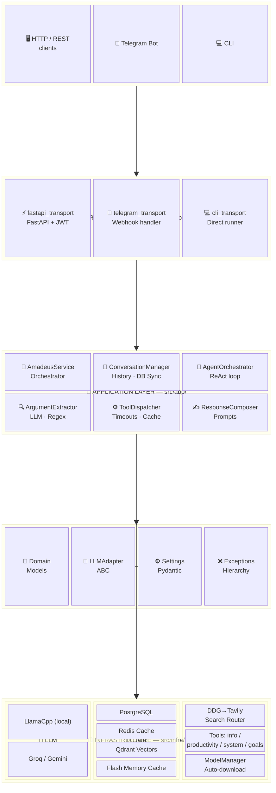
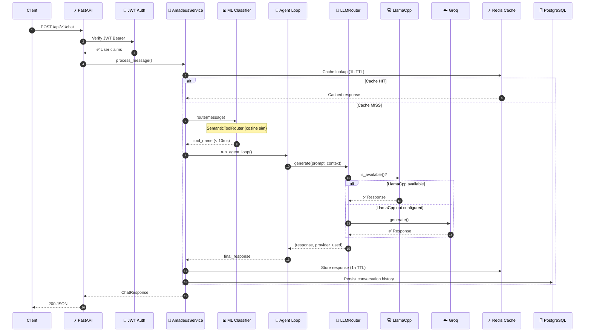
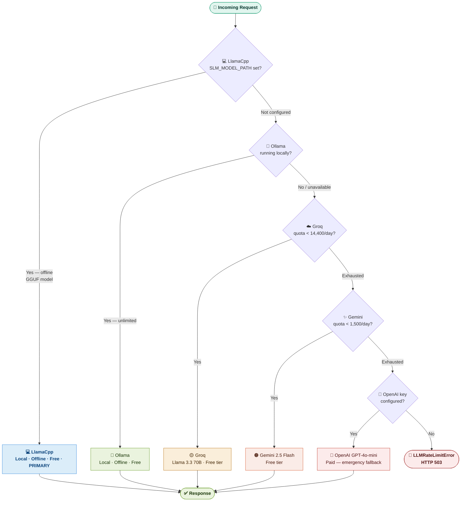

<div align="center">

# Amadeus AI v3.2.3

**A secure autonomous AI operating layer built on Clean Architecture — autonomous tool execution, long-horizon goal tracking, and multi-transport messaging unified under a single service layer.**

[](https://github.com/adityatawde9699/Amadeus-AI/actions)
[](https://www.python.org/downloads/)
[](https://fastapi.tiangolo.com)
[](LICENSE.txt)
[](https://github.com/astral-sh/ruff)

> **Tech Stack:**
> `Python 3.11+` · `FastAPI` · `SQLAlchemy 2.0` · `Groq (Llama 3.3)` · `Gemini` · `Redis` · `Qdrant` · `PostgreSQL` · `JWT Auth` · `Telegram` · `Docker` · `sentence-transformers` · `llama-cpp-python` · `huggingface_hub`

</div>

---

## 1. Problem Statement

Building a secure autonomous AI operating layer that is both capable and safe in production is unsolved by any single off-the-shelf tool:

| Pain Point | Reality |
|---|---|
| **Single-provider lock-in** | Most assistants fail completely when a rate limit exhausts. There is no built-in fallback chain across providers. |
| **No offline / privacy mode** | Cloud-only inference means every message leaves the machine. Local GGUF/Ollama options require manual wiring. |
| **No authentication boundary** | Open-source chatbot backends expose all endpoints without auth, making them unsafe to run on any networked machine. |
| **Prompt injection via messaging** | WhatsApp/Telegram bots accept arbitrary text — nothing prevents a user from injecting `Action: delete_file` into the ReAct loop. |
| **No tool execution safety** | Tool-calling agents can traverse the filesystem, exfiltrate files, or execute arbitrary code without any confirmation gate. |
| **No production observability** | No structured logging, no per-tool latency metrics, no health probes — impossible to operate or debug in production. |
| **No messaging channel auth** | Any Telegram user who knows the bot token can control the daemon. WhatsApp webhooks accept forged payloads. |
| **Memory amnesia** | Assistants lose context between sessions. Semantic search over past conversations requires custom infrastructure that most projects skip. |

---

## 2. What is Amadeus?

**Amadeus is a secure autonomous AI operating layer** — a persistent FastAPI backend that acts as the execution layer for autonomous operations. It is not a chatbot UI, not a thin wrapper around a single LLM, and not a prompt-engineering framework.

It is a **clean-architecture system** with the following defining properties:

### Multi-Transport Architecture
Requests arrive via three independent transport modules — `fastapi_transport.py` (HTTP/WebSocket), `telegram_transport.py` (Telegram Bot), and `cli_transport.py` (direct CLI) — all sharing a single `AmadeusService` singleton through the DI container.

### Autonomous Agent Loop
Every request enters a **ReAct (Reason + Act) agent loop** managed by `AgentOrchestrator`. The agent reasons, selects a tool, executes it, observes the result, and iterates — generating natural language only when sufficient information is gathered. Cycle detection, HITL confirmation gates, and tool execution timeouts guard against runaway loops.

### Multi-LLM Provider Router
A **priority-ordered fallback chain** routes inference requests:
```
LlamaCpp (local GGUF) → Groq (Llama 3.3 70B) → Gemini 2.5 Flash
```
Each provider tracks a **Redis-backed daily quota counter**. When a provider exhausts its quota or fails, the router falls back automatically. `LOCAL_ONLY_MODE=true` disables all cloud providers.

### Local Model Management
`ModelManager` (`src/infra/model_manager.py`) resolves and auto-downloads models into `Model/`:
- **Embed models**: saved to `Model/embed/<name>/` via `snapshot_download`
- **GGUF files**: downloaded from any HuggingFace repo via `hf_hub_download`
Configured entirely via `.env` — no manual file management required.

### 53 Sandboxed Tools
Amadeus executes a categorised registry spanning:
- **System**: volume, brightness, screenshots, hardware monitoring
- **Filesystem**: read, write, copy, move, search — all sandboxed to `SEARCH_ALLOWED_DIRS`
- **Productivity**: tasks, reminders, notes, Pomodoro, calendar
- **Information**: weather, news, Wikipedia, web search, math, time
- **Communication**: Telegram, Email
- **Goals**: `create_goal`, `update_goal`, `list_active_goals`

### Tiered Semantic Memory
Conversation context stored via Qdrant persistent vector store with `all-MiniLM-L6-v2` (384-dim) embeddings. A NumPy ring-buffer Flash Cache (L1, 100 entries) intercepts Qdrant for recently-accessed memories.

### Long-Horizon Goal Tracking
`GoalRepository` persists multi-step objectives across sessions in PostgreSQL. The agent can create, update, and list active goals as part of its normal tool loop, enabling it to maintain context over long-running projects.

### Defence-in-Depth Security
- **SEC-01**: Prompt injection resistance — `<user_task>` XML boundaries + `[BLOCKED:TOKEN]` neutralisation
- **SEC-03**: Telegram `MASTER_TELEGRAM_CHAT_ID` allowlist
- **HITL**: All destructive tools require explicit user confirmation (60-second timeout)
- **Filesystem sandboxing**: All path operations enforce `SEARCH_ALLOWED_DIRS`
- **JWT RBAC**: Per-route role enforcement

---

## 3. Solution Summary

Amadeus solves each pain point with a concrete, implemented mechanism:

| Pain Point | Amadeus Solution |
|---|---|
| Single-provider lock-in | 3-provider fallback chain with Redis daily quota tracking |
| No offline mode | LlamaCpp first in the chain; `LOCAL_ONLY_MODE=true` disables all cloud providers |
| No authentication | JWT Bearer on all protected routes, RBAC roles, per-user rate limiting |
| Prompt injection | `<user_task>` XML boundary + `[BLOCKED:TOKEN]` neutralisation (SEC-01) |
| Tool execution safety | HITL confirmation gate + `SEARCH_ALLOWED_DIRS` path validation |
| Memory amnesia | Persistent memory via Qdrant with idempotent deduplication |
| No long-horizon context | GoalRepository tracks multi-step objectives across sessions |
| Model scatter | ModelManager downloads and organises all models into `Model/` |

---

## 4. Features

### Conversational AI
- Multi-LLM routing: **LlamaCpp (local GGUF)** → Groq (Llama 3.3 70B) → Gemini 2.5 Flash
- **100% Local Inference**: `SLM_MODEL_PATH` loads a GGUF model directly via `llama-cpp-python` — zero network calls, zero API cost, full conversation memory
- **Local Server Option**: `LOCAL_ONLY_MODE` for complete offline privacy and zero-cost inference.
- **Redis-backed daily quota tracking** per provider — shared across all workers, auto-expires at midnight
- **Semantic long-term memory** via Qdrant vector search (`all-mpnet-base-v2` 768-dim embeddings) — top-3 relevant memories injected into the agent prompt on every request
- Persistent conversation memory with configurable context window
- Concurrent request limiting (`asyncio.Semaphore` — default 20 simultaneous chats)

### Messaging & Channels
- **Inbound webhooks** — Telegram Bot API
- **Outbound messaging dispatch** — `POST /api/v1/messaging/send` routes to Telegram or Email from one endpoint
- Email send/receive via SMTP (`aiosmtplib`) and IMAP (`imap_tools`)
- `GET /api/v1/messaging/status` — live readiness check for all configured channels

### Tool Execution Engine
**Information tools:**
- Current weather (OpenWeatherMap API)
- Top news headlines (NewsAPI)
- Wikipedia lookup with fallback search
- Web search via tiered SearchRouter (DuckDuckGo → Tavily)
- Date/time queries, unit conversions (temperature, length), math calculator
- Timer, greeting

**Productivity tools:**
- Task management (create, list, complete, summarize)
- Pomodoro timer (start, stop, status)
- Notes (create, list, retrieve)
- Reminders (set, list — with natural language time parsing via `dateparser`)

**System & monitoring tools:**
- System Controls (set/get volume, screen brightness, take screenshots, list open apps)
- Hardware monitoring (CPU, memory, disk, battery) with configurable alert thresholds

### Semantic Tool Routing (Zero-Training)
- **UnifiedSemanticRouter** (`src/app/services/semantic_router.py`) — single-stage embedding-based triage; replaces the legacy sklearn SVM + TF-IDF pipeline entirely
- **Model**: `sentence-transformers/all-mpnet-base-v2` (768-dim, CPU-only, no retraining required)
- **Mechanism**: Tool descriptions + intent anchors are embedded once and persisted to `Model/semantic_tool_embeddings.npz`. At query time, the user message is embedded and cosine-compared against the full matrix in a single NumPy `matmul` — **sub-10 ms on any CPU**, zero LLM calls
- **Hot-pluggable**: New tools registered in `ToolRegistry` are automatically re-embedded on the next startup via MD5 fingerprint cache invalidation — no retraining, no CI step
- **Routing outcomes**: `tool` (dispatches named tool) · `conversational` (local LLM prose) · `cloud_escalation` (routes to cloud LLM for high-complexity reasoning)
- **Threshold**: Configurable cosine similarity threshold (default `0.30`); queries below threshold fall back to `conversational`

### Omni-Workspace RAG (Hybrid Search)
- **WorkspaceIndexer** (`src/infra/workspace_indexer.py`) — hybrid BM25 + dense vector retrieval
- **Dual retrieval**: `all-mpnet-base-v2` dense embeddings + BM25Okapi lexical search, fused via Reciprocal Rank Fusion (k=60)
- **Exact-match recall**: Code-aware BM25 tokenizer preserves identifiers (`AUTH_UUID_7392`, port numbers, error codes) that dense embeddings miss
- **Incremental builds**: Only re-embeds files whose mtime or MD5 hash changed — subsequent runs take seconds
- **RAM-safe**: `max_chunks=15_000` default (≈66 MB total) with `mmap_mode='r'` loading — designed for 4 GB machines
- **Context-augmented chunking**: File-level metadata (imports, globals, headings) prepended to encoder input — display snippets stay clean
- **Workspace Search Tool** (`search_workspace`): Amadeus tool enabling autonomous semantic search over the local project repository
- **CLI**: `python scripts/index_workspace.py --root C:\Users\ASUS\Downloads --max-chunks 15000`

### API & Security
- **Permission Profiles**: Supports `READ_ONLY` and `SYSTEM_FULL` JWT claims to explicitly block destructive tool executions on unprivileged accounts.
- **Human-in-the-Loop (HITL) Validation**: Destructive or communicative actions pause agent execution, providing detailed **Action Previews** before waiting for human approval (60-second timeout, auto-deny).
- **Isolated Filesystem Sandbox**: `copy_file`, `move_file`, and `create_folder` validate all resolved paths against `SEARCH_ALLOWED_DIRS` via `_assert_in_allowed_dirs()`. Path traversal attempts return `"Access denied"` without touching the filesystem.
- **Agent Queue Backpressure**: The orchestrator enforces strict concurrency limits via `maxsize`, safely shedding excess loads with `HTTP 429` (Too Many Requests).
- **IPC Authentication**: Background RPC calls require an `X-IPC-Token` to prevent unauthenticated local access loops.
- **SEC-01 — Prompt Injection Resistance**: User input is wrapped in `<user_task>` XML tags; ReAct control tokens (`Action:`, `Thought:`, etc.) embedded in user text are neutralised with `[BLOCKED:TOKEN]` markers before reaching the LLM.
- **SEC-03 — Telegram Authorization**: `MASTER_TELEGRAM_CHAT_ID` allowlist enforced on every incoming message. Unauthorized `chat_id` values receive `"Unauthorized."` and are dropped.
- **SEC-06 — Secure SECRET_KEY**: Auto-generates a cryptographically-secure ephemeral key at startup if `SECRET_KEY` is not configured. Warns operators loudly. No more `"fallback"` literal.
- JWT Bearer authentication on all protected routes (`/chat`, `/tasks`, `/voice`, `/messaging`)
- Per-user JWT rate limiting (`slowapi`) with Redis storage + IP fallback; falls back to in-memory storage gracefully if Redis is unreachable.
- **OWASP-hardened logs** — no API keys, no raw user prompts, no auth tokens in any log statement
- Request audit logging middleware (unique request IDs, latency headers, client IP)
- **Bandit security scan**: 0 HIGH severity findings in CI — enforced as gate
- **pip-audit**: 0 actionable HIGH CVEs (1 known false positive for `ecdsa` permanently ignored)
- Prometheus metrics endpoint (`/api/v1/metrics`)
- Sentry error tracking integration

### Caching (Redis)
- LLM responses: 1-hour TTL — deduplicates identical prompts
- **LLM daily usage quotas**: `llm_usage:{provider}:{date}` — 86400s TTL, shared across workers
- TTS audio: 24-hour TTL — common phrases reuse synthesized audio bytes
- Tool results (stateless only): 5-minute TTL (weather, system stats)
- Web search results: 30-minute TTL (DDG, Tavily)
- Graceful fallback if Redis is unavailable

### Observability (Prometheus — `/api/v1/metrics`)

| Metric | Type | Description |
|--------|------|-------------|
| `amadeus_llm_calls_total{provider}` | Counter | Total LLM calls per provider |
| `amadeus_tool_calls_total{tool_name}` | Counter | Per-tool invocation count |
| `amadeus_tool_duration_seconds{tool_name,success}` | Histogram | Per-tool execution latency (10 buckets, 0.01s–30s) |
| `amadeus_tool_executions_total{tool_name,result}` | Counter | Per-tool result breakdown (success/failure/timeout/denied) |
| `amadeus_memory_errors_total{operation}` | Counter | Qdrant upsert/search failure count |
| `amadeus_cache_hit_rate` | Gauge | Cache hit % (updated on every cache hit) |
| `amadeus_llm_cost_usd` | Gauge | Estimated LLM spend in USD |
| HTTP latency histograms | Histogram | P50/P95/P99 per route via `prometheus-fastapi-instrumentator` |

**Health Probes (new in v3.2.1):**

| Endpoint | Auth | Purpose |
|---|---|---|
| `GET /health` | None | Basic liveness — always 200 while the process is running |
| `GET /api/v1/health/live` | None | Liveness probe for container orchestrators (Kubernetes, Docker Compose) |
| `GET /api/v1/health/ready` | None | Readiness probe — checks DB + Redis + Qdrant + LLM router; returns 503 with per-dependency map if any fail |

### CI/CD & Deployment
- GitHub Actions pipeline: lint (ruff — 100% clean), format check, strict type check (mypy), bandit (0 HIGH gate), pip-audit
- Automated test run with real PostgreSQL + Redis service containers
- **`train-model` CI job**: auto-generates semantic tool embeddings for the `SemanticToolRouter` when tool metadata changes; commits updated `.npz` artifacts to ensure zero cold-start latency in production.
- **Coverage threshold: 80%** enforced in both CI (`--cov-fail-under=80`) and locally via `pyproject.toml`
- Staging deploy to Railway on `develop` branch merge

---

## 5. System Requirements

### Runtime Environment

| Component | Minimum | Recommended | Notes |
|-----------|---------|-------------|-------|
| **Python** | 3.11 | 3.12 | 3.10 and below not supported |
| **RAM** | 2 GB | 8 GB | 2 GB for API-only (no local model); 4–8 GB for local GGUF inference |
| **Disk** | 3 GB | 10 GB | Includes Whisper `small` (~460 MB), Qdrant data, logs, and optional GGUF models (2–8 GB each) |
| **CPU** | 4-core x86-64 | 8-core+ | Multi-core required for concurrent LlamaCpp inference; ARM64 (Apple M-series) also supported |
| **GPU** | Not required | CUDA 11.8+ | Optional: faster Whisper STT; LlamaCpp `n_gpu_layers` offloading |
| **OS** | Linux / macOS / Windows 10+ | Ubuntu 22.04 LTS | Windows supported; Linux recommended for production Docker deployments |

### External Services

| Service | Version | Mode | Purpose |
|---|---|---|---|
| **PostgreSQL** | 15+ | Production | Conversation history, tasks, knowledge graph, user accounts |
| **SQLite** | 3.35+ | Development only | Zero-config alternative to PostgreSQL (not suitable for multi-worker deployments) |
| **Redis** | 6+ | Recommended | Rate limiting, LLM daily quota tracking, TTS + tool result caching. Falls back to in-memory if unavailable. |
| **Qdrant** | 1.7+ | Recommended | Vector memory store for long-term semantic recall. Runs local file-based by default (no server needed). |
| **Docker** | 24+ | Optional | Required only for the Python code-execution sandbox (`execute_python_script` tool) |

### LLM Model Requirements *(if using local inference)*

| Model Format | RAM Required | Example |
|---|---|---|
| GGUF Q4_K_M (3B) | ~3 GB | Llama-3.2-3B, Qwen2.5-3B |
| GGUF Q4_K_M (7B) | ~5 GB | Llama-3.1-7B, Gemma-2-9B |
| GGUF Q4_K_M (13B) | ~8 GB | Llama-2-13B |

> **Tip:** Set `SLM_MODEL_PATH` to your `.gguf` file path. No GPU required — LlamaCpp runs fully on CPU. Leave `SLM_MODEL_PATH` unset to skip local inference and use cloud providers only.

### Minimum Viable Setup (no local models, cloud APIs only)

```
Python 3.11 + 1 GB RAM + GROQ_API_KEY (free)
```
Redis and Qdrant are optional — the daemon gracefully degrades without them.

---

## 6. Setup & Installation

### Prerequisites

1. [Python 3.11+](https://www.python.org/downloads/)
2. [`uv`](https://docs.astral.sh/uv/) (recommended) or `pip`
3. [Docker & Docker Compose](https://docs.docker.com/get-docker/) (for containerized setup)
4. At minimum one LLM API key (Groq is free and recommended as primary)

### Clone the Repository

```bash
git clone https://github.com/adityatawde9699/Amadeus-AI.git
cd Amadeus-AI
```

### Environment Variables

Copy the example and fill in your values:

```bash
cp .env.example .env
```

**Required variables:**

| Variable | Description |
|----------|-------------|
| `SECRET_KEY` | JWT signing secret — generate with `python -c "import secrets; print(secrets.token_hex(32))"` |
| `GROQ_API_KEY` | Groq API key — [console.groq.com](https://console.groq.com) (free tier: 14,400 req/day) |
| `GEMINI_API_KEY` | Google Gemini key — [makersuite.google.com](https://makersuite.google.com/app/apikey) |
| `POSTGRES_PASSWORD` | Production DB password — the default `amadeus_password` is a development placeholder only |
| `DATABASE_URL` | Database connection string (defaults to PostgreSQL for multi-worker safety) |

**Optional variables:**

| Variable | Description |
|----------|-------------|
| `REDIS_URL` | Redis for caching + quota tracking (default: `redis://localhost:6379/0`) |
| `WEATHER_API_KEY` | OpenWeatherMap API key |
| `NEWS_API_KEY` | NewsAPI key |
| `TAVILY_API_KEY` | Tavily deep search |
| `SENTRY_DSN` | Sentry error tracking DSN |
| `TELEGRAM_BOT_TOKEN` | Telegram bot token — required for Telegram channel |
| `TELEGRAM_WEBHOOK_SECRET` | Secret header for Telegram webhook validation |
| `EMAIL_IMAP_SERVER` | IMAP server hostname (e.g. `imap.gmail.com`) |
| `EMAIL_SMTP_SERVER` | SMTP server hostname (e.g. `smtp.gmail.com`) |
| `EMAIL_SMTP_PORT` | SMTP port (default: `587`) |
| `EMAIL_ADDRESS` | Sender email address |
| `EMAIL_APP_PASSWORD` | Email app password (Gmail: generate in Account settings) |
| `QDRANT_URL` | Qdrant server URL for semantic memory (e.g. `http://localhost:6333`) |
| `ENV` | `development` / `staging` / `production` |

### Option A — Local Installation (without Docker)

```bash
# Install dependencies
uv sync --all-extras --dev

# Run database migrations
uv run alembic upgrade head

# Start via FastAPI transport
uv run python -m src.transports.fastapi_transport

# Or via CLI transport for testing
uv run python -m src.transports.cli_transport
```

### Option B — Docker (Development)

```bash
# Starts API + PostgreSQL
docker-compose up --build
```

### Option C — Docker (Production)

```bash
docker-compose --profile prod up --build -d
```

The production profile runs gunicorn with 4 Uvicorn workers (`UvicornWorker`) and resource limits (2 CPU / 1 GB RAM).

---

## 7. API Documentation

The API base path is `/api/v1`. Interactive docs are available at `http://localhost:8000/docs` when `DEBUG=true`.

All endpoints except `/health` and `/api/v1/llm/*` require a **JWT Bearer token** in the `Authorization` header.

### Authentication

There is no built-in user registration endpoint at this time. Tokens must be generated externally using the `SECRET_KEY` with HS256 algorithm. See `src/api/middleware/authentication.py`.

### Endpoints

#### System

| Method | Path | Auth | Description |
|--------|------|------|-------------|
| `GET` | `/health` | No | Liveness check (load balancer probe) |
| `GET` | `/` | No | API info and version |
| `GET` | `/api/v1/health/detailed` | No | Detailed health with DB/Redis status |
| `GET` | `/api/v1/metrics` | No | Prometheus metrics |

#### Chat

| Method | Path | Auth | Description |
|--------|------|------|-------------|
| `POST` | `/api/v1/chat` | Yes | Send a message to the assistant |
| `GET` | `/api/v1/chat/stream` | Yes | **SSE streaming** — real-time token-by-token response |
| `GET` | `/api/v1/chat/history` | Yes | Retrieve conversation history by session |
| `GET` | `/api/v1/chat/tools` | Yes | List all available tools by category |
| `POST` | `/api/v1/chat/clear` | Yes | Clear conversation history |

**SSE streaming example:**
```bash
curl -N -H "Authorization: Bearer $TOKEN" \
  "http://localhost:8000/api/v1/chat/stream?message=Tell+me+a+joke"
# Streams: data: {"delta": "Why"} ... data: [DONE]
```

**Chat request body:**
```json
{
  "message": "What is the weather in Mumbai?",
  "source": "api",
  "session_id": "optional-existing-session-id",
  "request_id": "optional-idempotency-key"
}
```

**Chat response body:**
```json
{
  "response": "The weather in Mumbai, IN: Haze. Temperature is 29.5°C (feels like 34.2°C). Humidity is 78%...",
  "source": "api",
  "session_id": "uuid-session-id",
  "tools_used": []
}
```

#### Messaging

| Method | Path | Auth | Description |
|--------|------|------|-------------|
| `POST` | `/api/v1/messaging/send` | Yes | Send outbound message (Telegram / Email) |
| `GET` | `/api/v1/messaging/status` | No | Check which channels are configured |
| `POST` | `/api/v1/webhooks/telegram` | Secret token | Receive inbound Telegram updates |

**Send message request:**
```json
{
  "channel": "telegram",
  "to": "123456789",
  "message": "Hello from Amadeus!"
}
```

#### Voice

| Method | Path | Auth | Description |
|--------|------|------|-------------|
| `WS` | `/api/v1/ws/voice` | Yes (via query param) | Real-time voice streaming WebSocket |

**Voice WebSocket protocol:**
1. Client sends raw audio bytes (PCM / WAV chunk)
2. Server responds with three messages in sequence:
   - `{"type": "transcription", "text": "what you said"}` — STT output
   - `{"type": "response_text", "text": "assistant reply"}` — LLM response
   - Binary frame — TTS audio bytes

#### Tasks

| Method | Path | Auth | Description |
|--------|------|------|-------------|
| `POST` | `/api/v1/tasks` | Yes | Create a new task |
| `GET` | `/api/v1/tasks` | Yes | List tasks (filter by status) |
| `PATCH` | `/api/v1/tasks/{id}/complete` | Yes | Mark task complete |
| `DELETE` | `/api/v1/tasks/{id}` | Yes | Delete a task |

#### LLM Usage (Informational — no auth)

| Method | Path | Auth | Description |
|--------|------|------|-------------|
| `GET` | `/api/v1/llm/usage` | No | Daily LLM usage report per provider |

---

## 8. Full Tech Stack

### Runtime & Language
- **Python 3.11 / 3.12** — primary language
- **Docker** — containerization (multi-stage build)

### Framework & API
- **FastAPI 0.118+** — async web framework
- **Uvicorn** — ASGI server (development)
- **Gunicorn + UvicornWorker** — production multi-worker setup
- **SlowAPI** — rate limiting (IP-based, per-minute window)
- **python-jose** — JWT encoding and validation

### Database & ORM
- **SQLAlchemy 2.0 (asyncio)** — async ORM
- **Alembic** — database migrations
- **PostgreSQL 15** (production) via `asyncpg`
- **SQLite** (development) via `aiosqlite`
- **Redis 5+** — caching layer (via `redis-py` async client)

### AI & LLM
- **Groq API (Llama 3.3 70B)** — Cloud primary LLM (free tier)
- **Google Generative AI (Gemini 2.5 Flash)** — Secondary cloud LLM
- **Qdrant** — vector database for semantic long-term memory
- **LLMRouter** — Redis-backed daily-quota-aware routing engine with atomic `INCR`/`EXPIRE`
- **SemanticToolRouter** — sentence-transformers based zero-training tool intent triaging
- **WorkspaceIndexer** — hybrid BM25 + dense vector retrieval engine for project RAG

### Voice
- **faster-whisper** — CTranslate2 Whisper STT (CPU/CUDA)
- **edge-tts** — Microsoft Edge TTS (free, cloud-based)
- **SpeechRecognition + pyttsx3** — alternative local TTS/STT stack *(optional)*

### Validation & Configuration
- **Pydantic v2 + pydantic-settings** — type-safe settings from environment
- **python-dotenv** — `.env` file loading

### Dependency Injection
- **dependency-injector 4.41+** — IoC container (`src/container.py`)

### Observability
- **Structlog** — structured JSON logging
- **Sentry SDK** — error monitoring
- **prometheus-fastapi-instrumentator** — Prometheus metrics

### Development & Quality
- **pytest + pytest-asyncio** — testing framework
- **testcontainers[postgres]** — integration tests with containerized PostgreSQL
- **httpx** — async HTTP client for FastAPI TestClient
- **Ruff** — linting and formatting
- **Black** — code formatter
- **Mypy** — static type checking
- **Bandit** — security scanning
- **pip-audit** — dependency vulnerability auditing
- **uv** — dependency management and virtual environments
- **rank-bm25** — lexical search for RAG
- **sentence-transformers** — dense vector embeddings for memory and routing

---

## 9. System Architecture

### Clean Architecture — Layer Overview



### Request Lifecycle — Chat Endpoint




<div align="center">

<!-- ═══════════════════════════════════════════════════════
     ARCHITECTURE DIAGRAM  —  rendered in browsers / GitHub
     ═══════════════════════════════════════════════════════ -->

<table width="100%" cellspacing="0" cellpadding="0" border="0">

<!-- CLIENT LAYER -->
<tr><td>
<table width="100%" cellspacing="0" cellpadding="0" border="0"
       style="border:1px solid #B5D4F4;border-left:4px solid #378ADD;border-radius:8px;background:#E6F1FB;margin-bottom:0">
<tr>
  <td style="padding:8px 14px 4px">
    <strong style="font-size:11px;letter-spacing:.08em;color:#0C447C">CLIENT LAYER</strong>
  </td>
</tr>
<tr>
  <td style="padding:4px 14px 10px">
    <code style="background:#dbedf9;border:1px solid #B5D4F4;border-radius:4px;padding:2px 8px;font-size:12px;color:#0C447C;margin-right:6px">HTTP / REST clients</code>
    <code style="background:#dbedf9;border:1px solid #B5D4F4;border-radius:4px;padding:2px 8px;font-size:12px;color:#0C447C">WebSocket — voice stream</code>
  </td>
</tr>
</table>
</td></tr>

<!-- ARROW -->
<tr><td align="center" style="padding:4px 0;font-size:18px;color:#888">↓</td></tr>

<!-- API LAYER -->
<tr><td>
<table width="100%" cellspacing="0" cellpadding="0" border="0"
       style="border:1px solid #AFA9EC;border-left:4px solid #7F77DD;border-radius:8px;background:#EEEDFE;margin-bottom:0">
<tr>
  <td style="padding:8px 14px 4px">
    <strong style="font-size:11px;letter-spacing:.08em;color:#26215C">API LAYER</strong>
    &nbsp;<code style="font-size:10px;color:#534AB7;background:none;border:none">src/api/</code>
  </td>
</tr>
<tr>
  <td style="padding:2px 14px 4px">
    <span style="font-size:10px;letter-spacing:.07em;text-transform:uppercase;color:#534AB7">Routes</span><br>
    <code style="background:#dddcf8;border:1px solid #AFA9EC;border-radius:4px;padding:2px 8px;font-size:12px;color:#3C3489;margin:2px 4px 2px 0;display:inline-block">/chat</code>
    <code style="background:#dddcf8;border:1px solid #AFA9EC;border-radius:4px;padding:2px 8px;font-size:12px;color:#3C3489;margin:2px 4px 2px 0;display:inline-block">/tasks</code>
    <code style="background:#dddcf8;border:1px solid #AFA9EC;border-radius:4px;padding:2px 8px;font-size:12px;color:#3C3489;margin:2px 4px 2px 0;display:inline-block">/voice</code>
    <code style="background:#dddcf8;border:1px solid #AFA9EC;border-radius:4px;padding:2px 8px;font-size:12px;color:#3C3489;margin:2px 4px 2px 0;display:inline-block">/health</code>
    <code style="background:#dddcf8;border:1px solid #AFA9EC;border-radius:4px;padding:2px 8px;font-size:12px;color:#3C3489;margin:2px 4px 2px 0;display:inline-block">/llm</code>
  </td>
</tr>
<tr>
  <td style="padding:4px 14px 10px">
    <span style="font-size:10px;letter-spacing:.07em;text-transform:uppercase;color:#534AB7">Middleware &amp; handlers</span><br>
    <code style="background:#dddcf8;border:1px solid #AFA9EC;border-radius:4px;padding:2px 8px;font-size:12px;color:#3C3489;margin:2px 4px 2px 0;display:inline-block">JWT auth</code>
    <code style="background:#dddcf8;border:1px solid #AFA9EC;border-radius:4px;padding:2px 8px;font-size:12px;color:#3C3489;margin:2px 4px 2px 0;display:inline-block">Audit logger</code>
    <code style="background:#dddcf8;border:1px solid #AFA9EC;border-radius:4px;padding:2px 8px;font-size:12px;color:#3C3489;margin:2px 4px 2px 0;display:inline-block">SlowAPI rate limiter</code>
    <code style="background:#dddcf8;border:1px solid #AFA9EC;border-radius:4px;padding:2px 8px;font-size:12px;color:#3C3489;margin:2px 4px 2px 0;display:inline-block">AmadeusError → 400</code>
    <code style="background:#dddcf8;border:1px solid #AFA9EC;border-radius:4px;padding:2px 8px;font-size:12px;color:#3C3489;margin:2px 4px 2px 0;display:inline-block">Generic → 500</code>
  </td>
</tr>
</table>
</td></tr>

<!-- ARROW -->
<tr><td align="center" style="padding:4px 0;font-size:13px;color:#888">↓ &nbsp;<em style="font-size:11px">Depends()</em></td></tr>

<!-- APPLICATION LAYER -->
<tr><td>
<table width="100%" cellspacing="0" cellpadding="0" border="0"
       style="border:1px solid #9FE1CB;border-left:4px solid #1D9E75;border-radius:8px;background:#E1F5EE;margin-bottom:0">
<tr>
  <td style="padding:8px 14px 4px">
    <strong style="font-size:11px;letter-spacing:.08em;color:#04342C">APPLICATION LAYER</strong>
    &nbsp;<code style="font-size:10px;color:#0F6E56;background:none;border:none">src/app/</code>
  </td>
</tr>
<tr>
  <td style="padding:4px 14px 10px">
    <code style="background:#c5edd9;border:1px solid #9FE1CB;border-radius:4px;padding:2px 8px;font-size:12px;color:#085041;margin:2px 4px 2px 0;display:inline-block">AmadeusService <em>(orchestrator)</em></code>
    <code style="background:#c5edd9;border:1px solid #9FE1CB;border-radius:4px;padding:2px 8px;font-size:12px;color:#085041;margin:2px 4px 2px 0;display:inline-block">ConversationManager</code>
    <code style="background:#c5edd9;border:1px solid #9FE1CB;border-radius:4px;padding:2px 8px;font-size:12px;color:#085041;margin:2px 4px 2px 0;display:inline-block">ArgumentExtractor</code>
    <code style="background:#c5edd9;border:1px solid #9FE1CB;border-radius:4px;padding:2px 8px;font-size:12px;color:#085041;margin:2px 4px 2px 0;display:inline-block">ToolDispatcher</code>
    <code style="background:#c5edd9;border:1px solid #9FE1CB;border-radius:4px;padding:2px 8px;font-size:12px;color:#085041;margin:2px 4px 2px 0;display:inline-block">ResponseComposer</code>
    <code style="background:#c5edd9;border:1px solid #9FE1CB;border-radius:4px;padding:2px 8px;font-size:12px;color:#085041;margin:2px 4px 2px 0;display:inline-block">UnifiedSemanticRouter</code>
    <code style="background:#c5edd9;border:1px solid #9FE1CB;border-radius:4px;padding:2px 8px;font-size:12px;color:#085041;margin:2px 4px 2px 0;display:inline-block">VoiceService — STT → LLM → TTS</code>
  </td>
</tr>
</table>
</td></tr>

<!-- SPLIT ARROWS -->
<tr><td>
<table width="100%" cellspacing="0" cellpadding="0" border="0"><tr>
  <td width="30%" align="center" style="padding:4px 0;font-size:12px;color:#888">↓ Core interfaces</td>
  <td width="70%" align="center" style="padding:4px 0;font-size:12px;color:#888">↓ Infrastructure services</td>
</tr></table>
</td></tr>

<!-- CORE + INFRA ROW -->
<tr><td>
<table width="100%" cellspacing="6" cellpadding="0" border="0"><tr valign="top">

  <!-- CORE -->
  <td width="28%">
  <table width="100%" cellspacing="0" cellpadding="0" border="0"
         style="border:1px solid #FAC775;border-left:4px solid #BA7517;border-radius:8px;background:#FAEEDA;height:100%">
  <tr><td style="padding:8px 12px 4px">
    <strong style="font-size:11px;letter-spacing:.08em;color:#412402">CORE</strong>
    &nbsp;<code style="font-size:10px;color:#854F0B;background:none;border:none">src/core/</code>
  </td></tr>
  <tr><td style="padding:4px 12px 10px">
    <code style="background:#f5d998;border:1px solid #FAC775;border-radius:4px;padding:2px 7px;font-size:11px;color:#633806;margin:2px 0;display:block">Domain models</code>
    <code style="background:#f5d998;border:1px solid #FAC775;border-radius:4px;padding:2px 7px;font-size:11px;color:#633806;margin:2px 0;display:block">Interfaces / ABCs</code>
    <code style="background:#f5d998;border:1px solid #FAC775;border-radius:4px;padding:2px 7px;font-size:11px;color:#633806;margin:2px 0;display:block">Config (Settings)</code>
    <code style="background:#f5d998;border:1px solid #FAC775;border-radius:4px;padding:2px 7px;font-size:11px;color:#633806;margin:2px 0;display:block">Exceptions</code>
  </td></tr>
  </table>
  </td>

  <!-- INFRA -->
  <td width="72%">
  <table width="100%" cellspacing="0" cellpadding="0" border="0"
         style="border:1px solid #F5C4B3;border-left:4px solid #D85A30;border-radius:8px;background:#FAECE7">
  <tr><td style="padding:8px 12px 4px">
    <strong style="font-size:11px;letter-spacing:.08em;color:#4A1B0C">INFRASTRUCTURE</strong>
    &nbsp;<code style="font-size:10px;color:#993C1D;background:none;border:none">src/infra/</code>
  </td></tr>
  <tr><td style="padding:4px 12px 10px">
  <table width="100%" cellspacing="4" cellpadding="0" border="0"><tr valign="top">
    <td width="33%">
      <table width="100%" cellspacing="0" cellpadding="6" border="0" style="background:#f8d5c4;border:1px solid #F5C4B3;border-radius:6px">
        <tr><td><strong style="font-size:12px;color:#4A1B0C">LLM router</strong><br><span style="font-size:11px;color:#993C1D">Groq · Gemini adapters</span></td></tr>
      </table>
    </td>
    <td width="33%">
      <table width="100%" cellspacing="0" cellpadding="6" border="0" style="background:#f8d5c4;border:1px solid #F5C4B3;border-radius:6px">
        <tr><td><strong style="font-size:12px;color:#4A1B0C">Cache — Redis</strong><br><span style="font-size:11px;color:#993C1D">llm · tts · tool · search</span></td></tr>
      </table>
    </td>
    <td width="33%">
      <table width="100%" cellspacing="0" cellpadding="6" border="0" style="background:#f8d5c4;border:1px solid #F5C4B3;border-radius:6px">
        <tr><td><strong style="font-size:12px;color:#4A1B0C">Persistence</strong><br><span style="font-size:11px;color:#993C1D">SQLAlchemy · Alembic</span></td></tr>
      </table>
    </td>
  </tr><tr valign="top" style="padding-top:4px">
    <td width="33%" style="padding-top:4px">
      <table width="100%" cellspacing="0" cellpadding="6" border="0" style="background:#f8d5c4;border:1px solid #F5C4B3;border-radius:6px">
        <tr><td><strong style="font-size:12px;color:#4A1B0C">Tools</strong><br><span style="font-size:11px;color:#993C1D">info · productivity · system</span></td></tr>
      </table>
    </td>
    <td width="33%" style="padding-top:4px">
      <table width="100%" cellspacing="0" cellpadding="6" border="0" style="background:#f8d5c4;border:1px solid #F5C4B3;border-radius:6px">
        <tr><td><strong style="font-size:12px;color:#4A1B0C">Speech</strong><br><span style="font-size:11px;color:#993C1D">Whisper STT · Edge TTS</span></td></tr>
      </table>
    </td>
    <td width="33%" style="padding-top:4px">
      <table width="100%" cellspacing="0" cellpadding="6" border="0" style="background:#f8d5c4;border:1px solid #F5C4B3;border-radius:6px">
        <tr><td><strong style="font-size:12px;color:#4A1B0C">Search router</strong><br><span style="font-size:11px;color:#993C1D">DDG → Tavily</span></td></tr>
      </table>
    </td>
    <td width="33%" style="padding-top:4px">
      <table width="100%" cellspacing="0" cellpadding="6" border="0" style="background:#f8d5c4;border:1px solid #F5C4B3;border-radius:6px">
        <tr><td><strong style="font-size:12px;color:#4A1B0C">RAG Engine</strong><br><span style="font-size:11px;color:#993C1D">WorkspaceIndexer</span></td></tr>
      </table>
    </td>
  </tr></table>
  </td></tr>
  </table>
  </td>

</tr></table>
</td></tr>

<!-- ARROW -->
<tr><td align="center" style="padding:4px 0;font-size:18px;color:#888">↓</td></tr>

<!-- DATA LAYER -->
<tr><td>
<table width="100%" cellspacing="0" cellpadding="0" border="0"
       style="border:1px solid #C0DD97;border-left:4px solid #639922;border-radius:8px;background:#EAF3DE;margin-bottom:0">
<tr>
  <td style="padding:8px 14px 4px">
    <strong style="font-size:11px;letter-spacing:.08em;color:#173404">DATA LAYER</strong>
  </td>
</tr>
<tr><td style="padding:4px 14px 10px">
<table width="100%" cellspacing="6" cellpadding="0" border="0"><tr>
  <td width="25%">
    <table width="100%" cellspacing="0" cellpadding="6" border="0" style="background:#d0e8a8;border:1px solid #C0DD97;border-radius:6px;text-align:center">
      <tr><td><strong style="font-size:12px;color:#173404">PostgreSQL</strong><br><span style="font-size:10px;color:#3B6D11">prod</span></td></tr>
    </table>
  </td>
  <td width="25%">
    <table width="100%" cellspacing="0" cellpadding="6" border="0" style="background:#d0e8a8;border:1px solid #C0DD97;border-radius:6px;text-align:center">
      <tr><td><strong style="font-size:12px;color:#173404">SQLite</strong><br><span style="font-size:10px;color:#3B6D11">dev</span></td></tr>
    </table>
  </td>
  <td width="25%">
    <table width="100%" cellspacing="0" cellpadding="6" border="0" style="background:#d0e8a8;border:1px solid #C0DD97;border-radius:6px;text-align:center">
      <tr><td><strong style="font-size:12px;color:#173404">Redis</strong><br><span style="font-size:10px;color:#3B6D11">cache</span></td></tr>
    </table>
  </td>
  <td width="25%">
    <table width="100%" cellspacing="0" cellpadding="6" border="0" style="background:#d0e8a8;border:1px solid #C0DD97;border-radius:6px;text-align:center">
      <tr><td><strong style="font-size:12px;color:#173404">Qdrant</strong><br><span style="font-size:10px;color:#3B6D11">vector DB</span></td></tr>
    </table>
  </td>
</tr></table>
</td></tr>
</table>
</td></tr>

</table>

</div>

</td></tr></table>

### LLM Routing Order

Every request passes through the `LLMRouter` which checks Redis daily-quota counters (atomic `INCR`/`EXPIRE`) before dispatching:



**Quota tracking keys in Redis:**

| Provider | Redis key | Daily limit | TTL |
|----------|-----------|-------------|-----|
| LlamaCpp | — (local GGUF, unlimited) | ∞ | — |
| Ollama | — (local server, unlimited) | ∞ | — |
| Groq | `llm_usage:groq:{date}` | 14,400 req | 86400 s |
| Gemini | `llm_usage:gemini:{date}` | 1,500 req | 86400 s |
| OpenAI | `llm_usage:openai:{date}` | 100 req | 86400 s |

Counters are incremented atomically with `INCR` and set to expire at midnight via `EXPIREAT`. All workers share the same counter, preventing cross-process over-quota.

---

## 10. Usage Examples

### Text Chat

```bash
# Authenticate (generate a JWT externally using SECRET_KEY and HS256)
TOKEN="your.jwt.token"

# Ask a question
curl -X POST "http://localhost:8000/api/v1/chat" \
  -H "Content-Type: application/json" \
  -H "Authorization: Bearer $TOKEN" \
  -d '{"message": "What is the weather in Delhi?", "source": "curl"}'

# Get current news
curl -X POST "http://localhost:8000/api/v1/chat" \
  -H "Content-Type: application/json" \
  -H "Authorization: Bearer $TOKEN" \
  -d '{"message": "Give me today'\''s technology news headlines"}'

# Start a Pomodoro timer
curl -X POST "http://localhost:8000/api/v1/chat" \
  -H "Content-Type: application/json" \
  -H "Authorization: Bearer $TOKEN" \
  -d '{"message": "Start a 25 minute Pomodoro for writing documentation"}'

# Add a task
curl -X POST "http://localhost:8000/api/v1/chat" \
  -H "Content-Type: application/json" \
  -H "Authorization: Bearer $TOKEN" \
  -d '{"message": "Add task: Review pull requests"}'

# Calculate
curl -X POST "http://localhost:8000/api/v1/chat" \
  -H "Content-Type: application/json" \
  -H "Authorization: Bearer $TOKEN" \
  -d '{"message": "What is 1234 * 5678?"}'
```

### Conversation History

```bash
# Retrieve history for a session
curl "http://localhost:8000/api/v1/chat/history?session_id=<SESSION_ID>" \
  -H "Authorization: Bearer $TOKEN"

# Clear conversation
curl -X POST "http://localhost:8000/api/v1/chat/clear" \
  -H "Authorization: Bearer $TOKEN"
```

### SSE Streaming

```bash
curl -N -H "Authorization: Bearer $TOKEN" \
  "http://localhost:8000/api/v1/chat/stream?message=Summarise+today%27s+news"
```

Each event is a JSON object. The stream ends with `[DONE]`:
```
data: {"delta": "Here"}
data: {"delta": " are"}
data: {"delta": " today's top news ..."}
data: [DONE]
```

### Outbound Messaging

```bash
# Send a Telegram message
curl -X POST http://localhost:8000/api/v1/messaging/send \
  -H "Authorization: Bearer $TOKEN" \
  -H "Content-Type: application/json" \
  -d '{"channel": "telegram", "to": "123456789", "message": "Hello from Amadeus!"}'

# Send an email
curl -X POST http://localhost:8000/api/v1/messaging/send \
  -H "Authorization: Bearer $TOKEN" \
  -H "Content-Type: application/json" \
  -d '{"channel": "email", "to": "user@example.com", "subject": "Daily Brief", "message": "Your briefing is ready."}'

# Check channel status
curl http://localhost:8000/api/v1/messaging/status
# {"telegram": true, "whatsapp": false, "email": true}
```

### Voice via WebSocket (Python client example)

```python
import asyncio
import websockets

async def voice_session():
    uri = "ws://localhost:8000/api/v1/ws/voice"
    headers = {"Authorization": "Bearer YOUR_JWT_TOKEN"}
    async with websockets.connect(uri, additional_headers=headers) as ws:
        with open("audio_chunk.wav", "rb") as f:
            await ws.send(f.read())
        transcription = await ws.recv()   # {"type": "transcription", "text": "..."}
        response_text = await ws.recv()   # {"type": "response_text", "text": "..."}
        audio_bytes   = await ws.recv()   # binary TTS audio

asyncio.run(voice_session())
```

---

## 11. Project Structure

<details>
<summary><strong>Expand full tree</strong></summary>

```
Amadeus-AI/
│
├── .github/                        # CI/CD workflows and issue templates
│   └── workflows/main.yml          # Lint → test → Docker build
├── CONTRIBUTING.md
├── CHANGELOG.md
├── SECURITY.md
├── CODE_OF_CONDUCT.md
│
├── alembic/                        # Database migration scripts
│   └── versions/
│
├── data/                           # Runtime data (gitignored)
│
├── deploy/
│   └── amadeus.service             # systemd unit for bare-metal Linux
│
├── Model/                          # All local models (managed by ModelManager)
│   └── embed/                      # Embedding models auto-downloaded here
│
├── scripts/
│   ├── generate_training_data.py
│   ├── index_workspace.py
│   └── retrain_classifier.py
│
├── src/
│   ├── container.py                # IoC container — wires all dependencies
│   │
│   ├── transports/                 # ── TRANSPORT LAYER ───────────────────────────
│   │   ├── fastapi_transport.py    # FastAPI app factory, JWT, rate limiting
│   │   ├── telegram_transport.py   # Telegram webhook adapter
│   │   └── cli_transport.py        # Direct CLI runner
│   │
│   ├── api/                        # ── API ROUTES & MIDDLEWARE ────────────────
│   │   ├── middleware/
│   │   │   ├── authentication.py   # JWT Bearer verification (HS256)
│   │   │   ├── rbac.py             # Permission profiles
│   │   │   └── audit_logger.py     # Request ID injection, latency headers
│   │   └── routes/
│   │       ├── chat.py             # POST /chat · GET /chat/stream (SSE)
│   │       ├── messaging.py        # POST /messaging/send
│   │       ├── webhooks.py         # Telegram inbound webhooks
│   │       ├── tasks.py            # CRUD /tasks
│   │       └── health.py           # /health/live · /health/ready
│   │
│   ├── app/                        # ── APPLICATION LAYER ─────────────────────
│   │   └── services/
│   │       ├── amadeus_service.py  # Thin orchestrator
│   │       ├── agent_loop.py       # ReAct agent + AgentOrchestrator
│   │       ├── autonomous_loop.py  # Proactive observation loop
│   │       ├── conversation_manager.py
│   │       ├── argument_extractor.py
│   │       ├── tool_dispatcher.py
│   │       ├── response_composer.py
│   │       ├── semantic_router.py  # Zero-training cosine triage
│   │       └── tool_registry.py
│   │
│   ├── core/                       # ── CORE LAYER (no external deps) ───────
│   │   ├── config.py               # Pydantic-settings typed env schema
│   │   ├── exceptions.py           # AmadeusError hierarchy
│   │   ├── domain/models.py        # Pydantic domain models
│   │   └── interfaces/
│   │       ├── llm.py              # LLMAdapter ABC
│   │       └── repositories.py     # Abstract repository interfaces
│   │
│   └── infra/                      # ── INFRASTRUCTURE LAYER ───────────────
│       ├── model_manager.py        # Auto-download embed + GGUF models
│       ├── llm/
│       │   ├── router.py           # Multi-LLM routing + Redis quota
│       │   ├── llama_cpp_adapter.py
│       │   ├── groq_adapter.py
│       │   └── gemini_adapter.py
│       ├── memory_service.py       # Qdrant + Flash Cache
│       ├── messaging/
│       │   ├── telegram_adapter.py
│       │   └── email_adapter.py
│       ├── cache/cache_service.py  # Redis async client
│       ├── persistence/
│       │   ├── database.py
│       │   ├── orm_models.py       # SQLAlchemy ORM (includes GoalORM)
│       │   └── repositories/
│       ├── search/search_router.py # DuckDuckGo → Tavily
│       └── tools/
│           ├── agent_tools.py      # Goal + schedule tools
│           ├── info_tools.py
│           ├── productivity_tools.py
│           ├── monitor_tools.py
│           └── system_tools.py
│
├── tests/
│   ├── unit/
│   └── integration/
│
├── Dockerfile
├── docker-compose.yml
├── pyproject.toml
├── alembic.ini
└── .env.example
```

</details>

**Layer responsibilities at a glance:**

| Layer | Path | Responsibility |
|-------|------|----------------|
| Transport | `src/transports/` | FastAPI ASGI app · Telegram webhook · CLI runner — each shares the same `AmadeusService` singleton |
| API | `src/api/` | HTTP routing, JWT auth middleware, request/response serialization |
| Application | `src/app/services/` | **Orchestrator** (`AmadeusService`) + focused sub-services: `ConversationManager`, `ArgumentExtractor`, `ToolDispatcher`, `ResponseComposer` |
| Core | `src/core/` | Domain models, interfaces, config, exceptions — zero external deps |
| Infrastructure | `src/infra/` | LLM adapters, DB, cache, memory, search, messaging, tools, `ModelManager` |
| Data | — | PostgreSQL · Redis · Qdrant · Flash Cache |

---

## 12. Testing

### Run All Tests

```bash
# Using uv
uv run pytest tests/ -v --cov=src --cov-report=term-missing

# Using pip
pytest tests/ -v --cov=src --cov-report=term-missing
```

### Run by Marker

```bash
pytest tests/ -m unit        -v          # unit tests only
pytest tests/ -m integration -v          # requires running PostgreSQL
pytest tests/ -m "not slow"  -v          # skip slow tests
```

### Coverage Threshold

| Environment | Threshold | Enforced by |
|-------------|-----------|-------------|
| Local | 80% | `pyproject.toml` `fail_under = 80` |
| CI (GitHub Actions) | 80% | `--cov-fail-under=80` |

### Integration Tests

Integration tests use `testcontainers[postgres]` to spin up a temporary PostgreSQL container — no manual database setup required:

```bash
pytest tests/ -m integration
```

### Load Testing

```bash
locust -f locustfile.py --host http://localhost:8000
```

---

## 13. Deployment Instructions

### Deploy to Railway (Staging — Automated)

Merging a pull request into the `develop` branch triggers automatic deployment to Railway staging via GitHub Actions. The `RAILWAY_TOKEN` secret must be configured in the repository's GitHub Actions secrets.

### Deploy to Railway (Manual)

```bash
npm install -g @railway/cli
railway login && railway link
railway up
```

Set the following environment variables in the Railway dashboard:
- `SECRET_KEY`, `GROQ_API_KEY`, `GEMINI_API_KEY`
- `DATABASE_URL` (Railway PostgreSQL plugin)
- `REDIS_URL` (Railway Redis plugin)
- `ENV=production`, `DEBUG=false`

### Deploy with Docker Compose

```bash
docker compose up -d

# View logs
docker compose logs -f amadeus

# Run migrations inside the container
docker compose exec amadeus uv run alembic upgrade head
```

### Deploy as a Linux Daemon

```bash
# Copy the unit file
sudo cp deploy/amadeus.service /etc/systemd/system/

# Enable and start
sudo systemctl daemon-reload
sudo systemctl enable amadeus
sudo systemctl start amadeus
sudo journalctl -u amadeus -f
```

### Deploy as a Standalone Windows Daemon

The entire backend (including database migrations, local ML models, and API framework) can be compiled into a zero-dependency headless Windows process.

**1. Compilation**  
*(Requires an active python virtual environment)*
```bash
python scripts\build_windows.py
```

**2. Manual Execution**  
To run the background process and automatically validate your `.env` configuration:
```bash
Launch_Amadeus.bat
```
*(Logs are written to `data\logs\amadeus.log`. Stop it via Task Manager)*

**3. Install as a Native Windows Service (Recommended)**  
Launch PowerShell as Administrator to bind the executable to Windows boot:
```powershell
powershell -ExecutionPolicy Bypass -File scripts\install_windows_service.ps1
```

The Dockerfile is a **3-stage multi-stage build:**

| Stage | Purpose |
|-------|---------|
| `builder` | Installs Python dependencies |
| `model_cache` | Pre-downloads Whisper `small` model (~460 MB) — eliminates cold-start latency |
| `runtime` | Minimal production image, non-root user (`amadeus`) |

The container entrypoint:
```bash
alembic upgrade head && uvicorn src.api.server:app --host 0.0.0.0 --port 8000 --workers 1
```

---

## 14. Known Limitations

- **No user registration or RBAC**: JWT tokens must be generated externally. There is no `/register` or `/login` endpoint. All authenticated users share the same assistant context unless `session_id` is explicitly scoped per request.
- **Session isolation is caller-scoped**: The `AmadeusService` singleton reads `session_id` from the incoming request at the API layer. Concurrent requests with different session IDs are correctly isolated at the `ConversationManager` level, but share the same singleton service instance — full per-request instance isolation requires the DI container to be refactored to a request-scoped provider.
- **Voice WebSocket — no auth on upgrade**: WebSocket JWT enforcement depends on the client handshake; the server accepts connections and errors downstream if the token is missing.
- **Local TTS/STT resource usage**: Running `faster-whisper` (`small` model) and Edge TTS simultaneously on a single CPU core may cause response latency of 1–5 seconds per voice round-trip.
- **Semantic memory — Qdrant must be running**: If `QDRANT_URL` is not configured or Qdrant is unreachable, memory retrieval is silently skipped — the agent continues without memories. The Flash Memory Cache (L1) provides a high-speed fallback for recent interactions.
- **`calculate` tool uses `simpleeval` (eval RCE mitigated)**: The calculator sanitises input but does not support symbolic maths or matrix operations. Use `execute_python_script` for complex numerical workloads.

---

## 15. Future Improvements

- **Session-scoped DI container**: Refactor `container.py` to use request-scoped `AmadeusService` providers, eliminating the singleton session-ID assumption and enabling true concurrent multi-user isolation.
- **User authentication system**: Implement `/auth/register`, `/auth/login`, and `/auth/refresh` endpoints with persistent user-scoped session and memory isolation.
- **RBAC**: Add role-based access control to support multi-tenant usage with per-user tool permission profiles beyond the current binary `READ_ONLY` / `SYSTEM_FULL` split.
- **WebSocket JWT enforcement**: Move token validation to the WebSocket upgrade handshake (HTTP 101) rather than relying on downstream session checks.
- **Streaming TTS over WebSocket**: Return Edge TTS audio chunks as they are synthesised rather than buffering the entire response — reduces perceived voice latency by 40–60%.
- **`ArgumentExtractor` unit tests**: The extractor is now fully decoupled; add parametrised tests for all 15 regex fast-paths and the LLM JSON extraction flow with a mocked `LLMRouter`.
- **Mobile / browser SDK**: Thin TypeScript client library wrapping the SSE streaming and voice WebSocket endpoints.
- **Cost dashboard**: Grafana dashboard consuming the Prometheus cost gauges with daily/monthly aggregations and per-provider breakdown.

---

## 16. License

This project is licensed under the **Apache License, Version 2.0**.

See [LICENSE.txt](LICENSE.txt) for the full license text.

```
Copyright 2024 Aditya Tawde

Licensed under the Apache License, Version 2.0 (the "License");
you may not use this file except in compliance with the License.
You may obtain a copy of the License at

    http://www.apache.org/licenses/LICENSE-2.0
```

---

## 17. Author

**Aditya Tawde**

- GitHub: [@adityatawde9699](https://github.com/adityatawde9699)
- Repository: [github.com/adityatawde9699/Amadeus-AI](https://github.com/adityatawde9699/Amadeus-AI)
