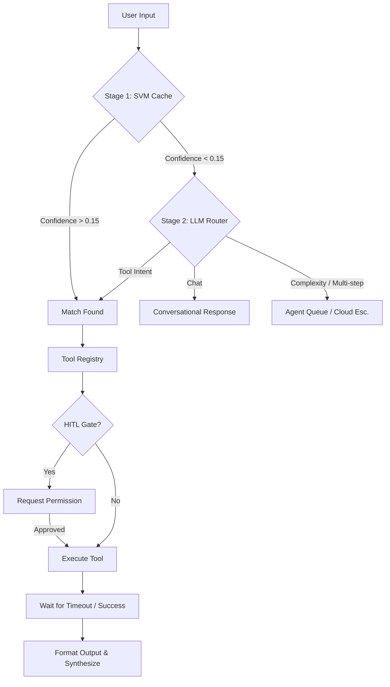

  

# 
A M A D E U S T O O L R E G I S T R Y

  <i>The definitive manual for agentic orchestration and multi-domain automation.</i>

---

## 🚀 Navigation Dashboard

  
  
  
  
  
  

---

## 🛡️ Security Protocol (HITL Gates)
Tools marked with 🛡️ **HITL** require **Human-In-The-Loop** confirmation. Amadeus will wait for your physical approval before executing these sensitive actions.

- **`terminate_program`**: Closing server-side or local processes.
- **`empty_recycle_bin`**: Permanent system cleanup.
- **`delete_file`**: Irreversible local file removal.
- **`execute_python_script`**: Running code in ephemeral sandboxes.
- **`send_email`**: External SMTP mail delivery.

---

## ⚙️ System & Hardware
### Control your environment with direct OS-level orchestration.

| Tool | Status | Purpose | Example Command |
| :--- | :---: | :--- | :--- |
| `open_program` | ✅ | Launches desktop applications. | "Open Visual Studio Code" |
| `terminate_program` | 🛡️ | Kills running processes. | "Close the VLC player" |
| `take_screenshot` | ✅ | Captures the active display. | "Take a screenshot" |
| `set_volume` | ✅ | Adjusts or mutes speaker output. | "Set volume to 80%" |
| `get_volume` | ✅ | Checks current audio levels. | "What's the volume at?" |
| `set_brightness` | ✅ | Adjusts monitor brightness. | "Dim the screen" |
| `list_open_apps` | ✅ | Lists all foreground apps. | "What's open right now?" |

---

## 📬 Communication & Messaging
### Bridge the gap between mail, chat, and team collaboration.

| Tool | Status | Purpose | Example Command |
| :--- | :---: | :--- | :--- |
| `read_unread_emails`| ✅ | Summarizes Gmail/IMAP inbox. | "Any new emails?" |
| `send_email` | 🛡️ | Delivers mail via SMTP. | "Email John about the plan" |
| `send_slack_msg` | ✅ | Posts to team channels. | "Slack #dev: Server is up" |
| `read_outlook` | ✅ | Reads local Outlook mail. | "What's in my Outlook?" |
| `send_outlook` | ✅ | Sends via local Outlook. | "Send an Outlook mail to HR" |

> [!TIP]
> **🚀 RGB Power Flow (Messaging)**:
> "Amadeus, fetch the last 5 messages from Slack #dev, summarize them, and send that summary to my Outlook inbox."

---

## 🏗️ Filesystem & Office
### Professional document generation and deep-file management.

| Tool | Status | Purpose | Example Command |
| :--- | :---: | :--- | :--- |
| `create_excel` | ✅ | Generates formatted .xlsx files. | "Make an Excel of my data" |
| `create_word` | ✅ | Generates formatted .docx docs. | "Draft a Word document" |
| `search_file` | ✅ | Recursively finds files. | "Find 'report.pdf' on Desktop" |
| `read_file` | ✅ | Scans PDF/DOCX/TXT content. | "What's in 'readme.md'?" |
| `delete_file` | 🛡️ | Removes files permanently. | "Delete the old log file" |

---

## 🌍 Information & Web Search
### Real-time intelligence from across the globe.

| Tool | Status | Purpose | Example Command |
| :--- | :---: | :--- | :--- |
| `web_search` | ✅ | Tiered search (Tavily/DDG). | "Who won the game?" |
| `wikipedia` | ✅ | Deep reference lookups. | "Who is Alan Turing?" |
| `get_weather` | ✅ | Real-time weather/forecast. | "Is it raining in Mumbai?" |
| `get_news` | ✅ | Curated news by topic/country. | "Tech news from USA" |
| `fetch_webpage` | ✅ | Direct URL text extraction. | "Summarize https://news.com" |
| `calculate` | ✅ | Complex math & conversions. | "15% of 5000 divided by 2" |

---

## ⚡ Developer & Advanced
### Tools for system administration and secure execution.

| Tool | Status | Purpose | Example Command |
| :--- | :---: | :--- | :--- |
| `execute_python` | 🛡️ | Runs code in local sandbox. | "Write a script to sort photos" |
| `terminal_cmd` | ✅ | Executes shell commands. | "What is my IP address?" |
| `git_status` | ✅ | Checks repo state. | "Is my git clean?" |
| `system_status` | ✅ | Live hardware dashboard. | "Current CPU and RAM?" |

---

## 🧠 Triage Architecture
How Amadeus instantly decides which tool to use, powered by the new hybrid routing system:

---

  <i>Amadeus AI Assistant v3.0 | Built with Neo-Glow Aesthetics</i>

